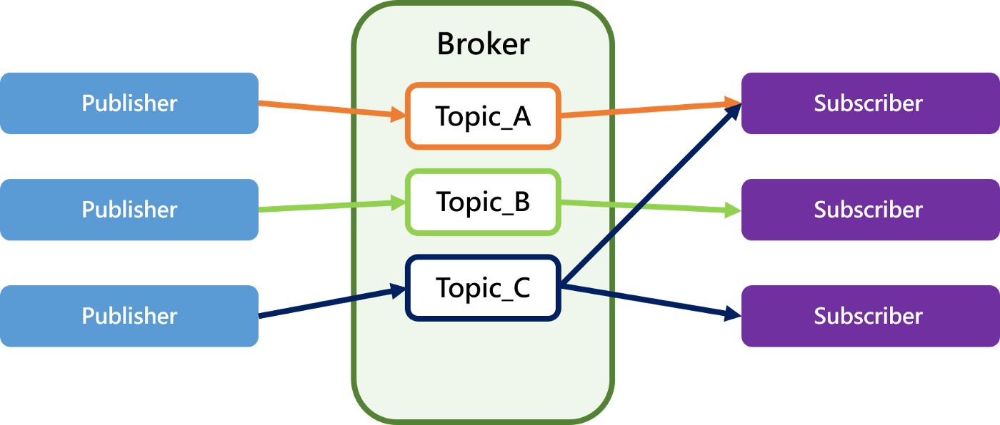

### Websocket and MQTT

___

#### Weboscket

- Weboscket是一種建立於TCP上的通訊協定，可在單個TCP連接上建立雙向通訊
- 和HTTP相容，但是相較於HTTP，Websocket為全雙工式，因此Server可以主動傳輸訊息給Client
- 主要應用於聊天室等需要一直更新來自Server的訊息的場景，聊天室這類的應用如果使用HTTP，則需要等到Client送出訊息才能收到來自Server的更新，或是使用輪詢(polling)的方式，顯而易見會造成資源的浪費

___

#### MQTT

- MQTT是一種物聯網的通訊協定，採用Publish/Subscribe的模式
- Publisher不會直接把訊息傳送給Subscriber，Subscriber只接受已訂閱的Top(主題)，且是由Broker轉發給Subscriber，而非Publisher直接發送
- 其主要運作原理是，Subscriber告知Broker想要訂閱的Top(主題)，當Publisher發布內容時，Broker會根據Top發送給Subscriber
  
- 由於有Broker當中繼站，Publisher和Subscriber並不需要知道對方的IP位址
- MQTT 定義了三個層級的品質(Qos)，適用於不同的情況
  - Qos 0(at most once，至多一次):
    - 在此設定下，Publisher就只丟一次訊息，不管Broker有沒有接收到
    - 適用於有線網路連接或是資料少一筆也沒有關係的情況
    
  - Qos 1(at least once 至少傳一次):
    - 在此設定下，Broker在接收到來自Publisher的訊息後，會回傳一個PUBACK以告知Publisher有接收到訊息
    - 但是如果在Broker回傳訊息的過程中斷線或是發生錯誤，Publisher會以為沒有收到訊息而重傳，造成Broker重複接收該訊息
    
  - Qos 2(exactly once 確實傳送一次):
    - 在此設定下，Broker在收到訊息後會暫存訊息的封包識別碼，並且回傳一個PUBREC給Publisher
    - Publisher接受到PUBREC之後會再回傳PUBREL給Broker，告訴Broker可以發送訊息了
    - Broker接收到PUBREL後會將訊息發送給Subscriber，同時釋放暫存的封包識別碼，並回傳PUBCOMP給Publisher告知已結束
    

___

#### 資料來源

- [維基百科(Websocket)](https://www.google.com/url?sa=t&rct=j&q=&esrc=s&source=web&cd=&cad=rja&uact=8&ved=2ahUKEwjli8f0lsb6AhWL6mEKHWMyAfwQFnoECAcQAQ&url=https%3A%2F%2Fzh.wikipedia.org%2Fzh-tw%2FWebSocket&usg=AOvVaw3tChWMEzL154__Meb4-XK8)
- [iT邦幫忙](https://ithelp.ithome.com.tw/articles/10249282)
- [Medium](https://medium.com/%E5%BD%BC%E5%BE%97%E6%BD%98%E7%9A%84-swift-ios-app-%E9%96%8B%E7%99%BC%E6%95%99%E5%AE%A4/ios-x-iot-2-mqtt-%E7%B0%A1%E4%BB%8B-e750aa420162)