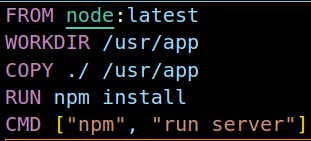
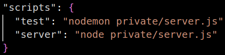

# 本周進度

## 大綱

1. 將server包進docker image並執行
2. 學習關聯式資料庫(SQLite)
3. 資料結構的全英文報告

#### Docker

1. 一開始我是用韋翰寫的腳本命令執行,但是在contaier內似乎沒有辦法辨識到package.json內的script
  - 
  - 
  - 後來改回原本的指令就可以正常執行了
2. 原本在VM上執行server的方式是要到網頁中開啟終端機才能跑,如果用ssh連進去的話一把連線中斷server就會關機了,但是如果改用docker就不會有這個問題
3. 因為當時的網路環境極差,如果在我的電腦建完在丟上去VM大概會等到死,所以我們把程式碼丟到github上,在VM進行git clone後再build image
4. docker建置image命令:
   - sudo docker build -t capstone .
5. docker執行命令
   - sudo docker run -d --net host capstone
   - -d是背景執行的參數
   - 之所以採用--net host是因為這個server是在VM上執行,我們不確定用橋接模式能不能運作,畢竟這個模式還需要調整網卡的設定,所以乾脆讓container直接使用host(VM)的網路

#### 資料庫

- 目前我先學的是SQLite,因為之前在學爬蟲的時候有先接觸過一點比較好上手,未來的專題也會用到資料庫(不過應該是SQL或MySql這種需要server的)
- SQLite的優點是檔案很小,適合放在嵌入式系統或是小型程式碼中,但是不具備身份驗證(密碼)等安全防護
- 語法的部份,目前是有看到有人說SQLite跟SQL很像,不過因為我還沒看SQL,所以這方面沒有辦法評論