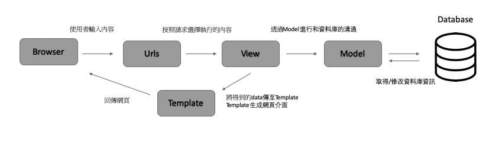

# 本周進度

## 大綱

1. 學習Django
2. 準備英文專題報告

#### Django

- 一種Python網頁框架(包含前後端),Instagram就是用這種框架進行開發的
- 框架邏輯如下：
  
- 在專案的資料夾內,會有以下幾個檔案
  - init.py =>讓python知道這個資料夾內是一個套件(後續會以套件的方式使用資料夾內的內容)
  - asgi.py =>還沒用到,不知道這是什麼
  - settings.py =>整個專案的設定(語系,時區...等)
  - urls.py =>設定訪客request路徑導向,目前使用path這個function來處裡網頁的導向
  - wsgi.py =>還沒用到,不知道這是什麼
- 建立"功能(app)"時,使用"python manaage.py startapp <appname\>"來建立,系統會自動生成資料夾並產生檔案如下
  - init.py =>同上
  - admin.py =>負責定義 Django admin的相關設定(還沒用到過)
  - apps.py =>應用程式設定
  - migrations =>資料庫的紀錄與同步歷史會記錄於此
  - models.py =>用來管理資料庫相關之聯通
  - tests.py => 用於程式的自動化測試
  - views.py =>接受請求並運行業務邏輯,目前用來執行client對於catalog這個網頁的請求的跳轉
- 本週進度：
  - 理解django project內各個檔案的用途以及django的運作邏輯
  - 在本機的8000埠下建立一個分頁,透過HttpResponse回傳"server test"字樣