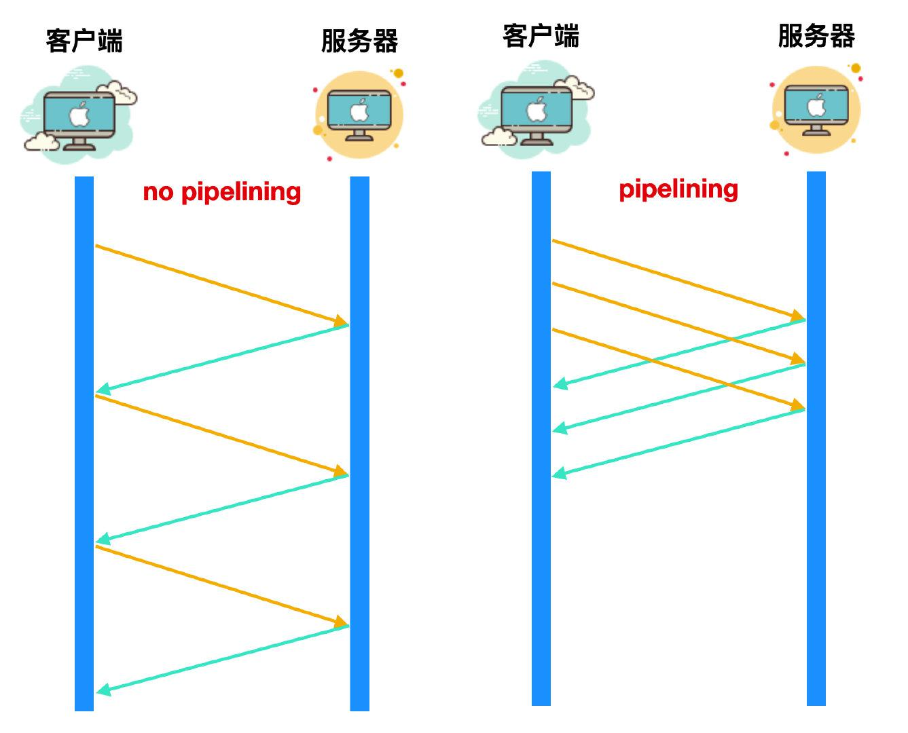

### HTTP and HTTPS

___

#### HTTP

- HTTP全名為超文本傳輸協議(HyperText Transfer Protocol)，預設使用80埠通訊
- 一共有6種常見請求方法
  - GET
    - 最常見的用法之一，本質就是傳送一個請求來取得伺服器上的某一資源
  - HEAD
    - 本質上和GET差不多，但是不傳送資料，只有header的部分
    - 看似無用，實際上可用來確認某網頁是否存在，而不用等待伺服器傳回大量文本
  - POST
    - 最常見的用法之二，向伺服器提交資料，幾乎目前所有的操作都是靠這個完成
  - PUT
    - 和POST很像，但是PUT指定資料在伺服器上的存放位置，POST則無
  - DELETE
    - 用來刪除伺服器上的某一資源，基本上很少看到
  - OPTION
    - 可用來獲取當前URL支援的請求方法，返回一個header為ALLOW的標頭，值為支援的方法，如"GET,POST"
- 在舊版本中，請求會有阻塞的現象，須等到前一個請求處理完畢才會處理下一個，直到HTTP1.1提出pipelining的概念後才有改善(如圖)
  
- 不過，pipelining並沒有那麼好，只有GET和HEAD等請求方式可以使用，POST由於可能存在先後順序所以不支援，且大部分代理伺服器廠商並不支援pipelining

___

#### HTTPS

- HTTPS全名為超文本傳輸安全協議(HyperText Transfer Protocol Secure)，預設使用443埠
- 相較於HTTP，HTTPS提供安全連線，以避免中間人攻擊和竊聽等網路攻擊
- HTTPS中所有文本都被加密，包含標頭檔
- 在相容性方面，近年來大部分瀏覽器都提供HTTPS-Only模式，若網站未使用HTTPS，瀏覽器將會強制跳出提醒，使用者必須手動同意方可瀏覽
- 其實HTTPS除了加密以外和HTTP沒有太大的差別，包括請求方式等等
___

#### 資料來源

 - [程式人生(HTTP請求方式)](https://www.796t.com/content/1543599004.html)
 - [HTTP2.0](https://iter01.com/614030.html)
 - [維基百科](https://zh.wikipedia.org/zh-tw/%E8%B6%85%E6%96%87%E6%9C%AC%E4%BC%A0%E8%BE%93%E5%8D%8F%E8%AE%AE)