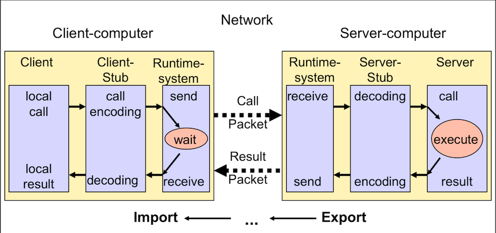

### RPC

- RPC全名為遠端程序呼叫（Remote Procedure Call）
- 主要的功能是讓遠端的其他台電腦透過TCP/UDP/HTTP等等的網路通訊方式，使用本地端的function
- 主要流程圖如下
  
- 原理是提供function的電腦(Server)將function export出來，使用function的電腦(Client)再把function import進來，在使用上就跟一般的函式一樣引入

___

#### 資料來源

- [iT邦幫忙](https://ithelp.ithome.com.tw/articles/10223580)