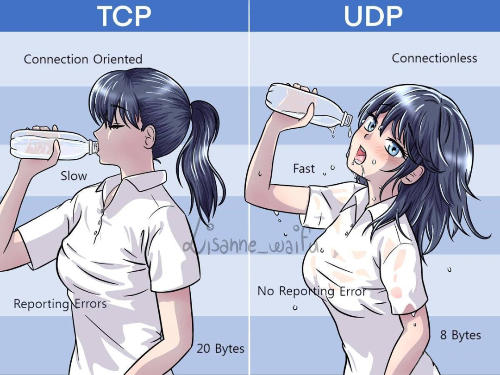

### TCP and UDP

___

#### TCP

- TCP全名為通訊控制協定(Transmission Control Protocol)
- TCP執行可分成三個階段，連接建立(connection establishment)、資料傳送（data transfer）和連接終止（connection termination）
- 在連接建立的階段中，TCP有一個象徵性的動作，稱為三次握手(three-way handshake)，同時在連接終止的階段中，需要經過四次握手
- 由於傳輸資料前會先確認連線，所以連線穩定度會比UDP來的好，掉包率也比較低，適合用來傳輸不大的資料，缺點就是速度比起UDP慢
- 資料的傳輸方式是按順序傳送的，因此即使網路堵塞也不會造成掉封包的現象

___

#### UDP

- UDP全名為使用者資料包協定（User Datagram Protocol)
- UDP是一種無連接的協議，資料是以串流方式傳遞的，所以通常必須以一定程度的資料遺失為前提來進行使用，例如串流媒體，線上遊戲等即時服務
- 由於UDP協議不需建立連接，且資料送出後不會確認client是否收到，因此傳輸速度非常快(相較於TCP)

___

###### 一張圖完美說明TCP和UDP的關係

___

#### 資料來源

- [NordVPN](https://nordvpn.com/zh-tw/blog/tcp-udp-bijiao/)
- [維基百科](https://zh.wikipedia.org/zh-tw/%E4%BC%A0%E8%BE%93%E6%8E%A7%E5%88%B6%E5%8D%8F%E8%AE%AE)
- [CSDN](https://blog.csdn.net/freekiteyu/article/details/72236734)