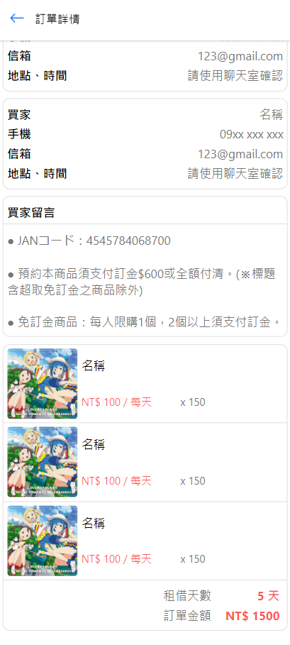

# 專題筆記
02/11 ~ 02/xx, 2023

### 進度
- 完成大部分畫面
- 將目前的成品放到 Azure

### To Do List
- 用 jsondb 作為臨時資料庫寫 API
- 剩餘的畫面 => 寫到那邊的功能時再一起完成

### 畫面
- 首頁 / 搜尋頁面

    

- 商品頁

    

- 購物車

    

- 結帳畫面

    

- 購買清單 / 我的訂單

    

- 訂單詳情

    

- 個人資料

    

- 我的收藏

    

- 賣場資訊

    

- 我的商品

    

- 新增商品

    

- 註冊 / 登入

    

- 聊天室

    

- 聊天對話

    