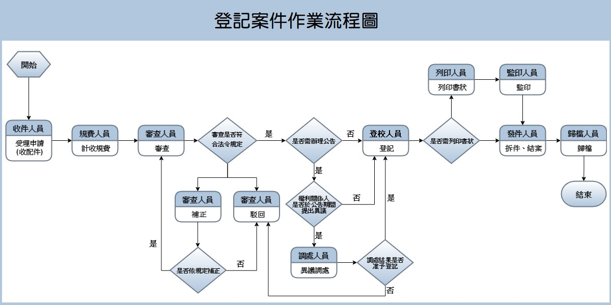
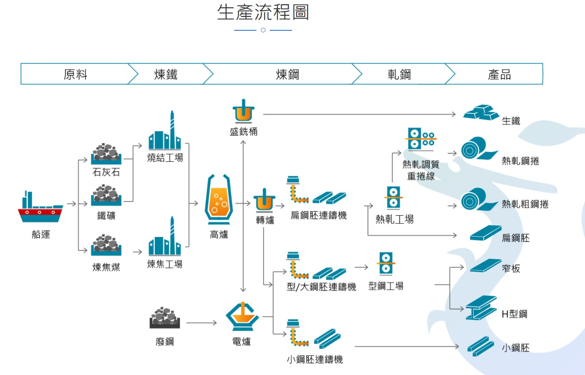

# 第23周 開會紀錄 (2023/02/28)

### 開會紀錄
- 更改之後開會時間: 星期三晚上 8:00 ~ 8:30
- 3/29 小目標: 商品可以公開展示 (不用購物車、結帳)
  - 登入、註冊
  - 新增、編輯、刪除商品
  - 搜尋商品
  - 商品展示
  - 賣場展示

### 關鍵字
- Swagger
- OpenAPI
- RESTFul

### 參考
- [顧客旅程地圖](https://mixpanel.com/zh-hant/blog/%E9%A1%A7%E5%AE%A2%E6%97%85%E7%A8%8B%E5%9C%B0%E5%9C%96/)
- [產品PM必懂！「流程圖」的畫法及變形應用](https://www.projectup.net/article/view/id/16740)
- 流程圖 (以時間軸為主，來思考使用者可能的動作)
    
    