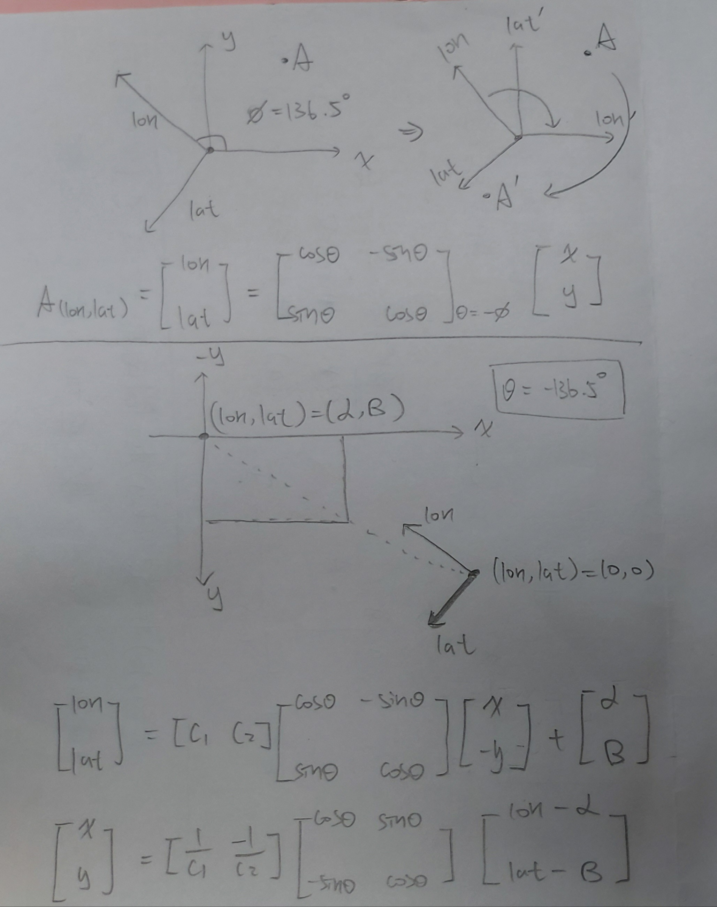

# 09/21 ~ 09/27, 2023

### 程式碼
- [標點工具 & 路徑規劃](https://github.com/wei06097/NTUST_Map_Marker)

### 進度
- 實作路徑規劃演算法並視覺化結果
- 嘗試做經緯度與平面圖的座標轉換(主要用來顯示使用者目前位置)
  - 使用旋轉矩陣
    - 嘗試失敗，後來發現算式有小錯誤
    - 修正後的算式還未使用程式測試
  - 可能會失敗的其他原因
    - 經緯度並非是在歐幾里得平面上垂直，或許需要做另外的投影
    - 但地球的取率半徑很大，台科大校園的曲面應該能直接近似平面
    - 若最終無法實現，就直接標點

### 旋轉矩陣
1. 假設有 (x, y) 和 (a, b) 兩個座標軸
2. 最初的作法是將 (x, y) 座標旋轉至 (a, b) 座標，點不旋轉，但最後參考座標還是在 (x, y)
3. 現在是將 (x, y) 與 (a, b) 座標重疊，旋轉點，最後參考座標會變到 (a, b)
4. 兩個方法間 theta 差了一個負號，也是造成錯誤的原因

